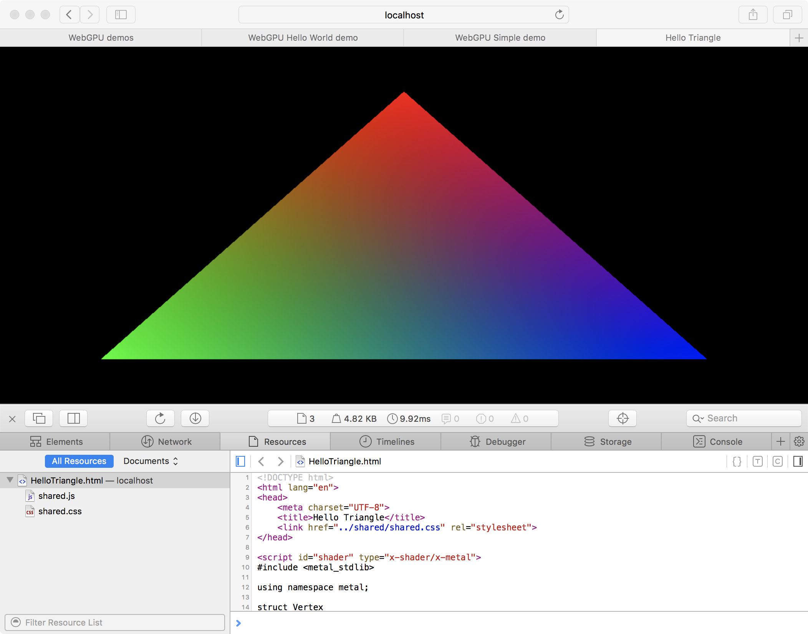
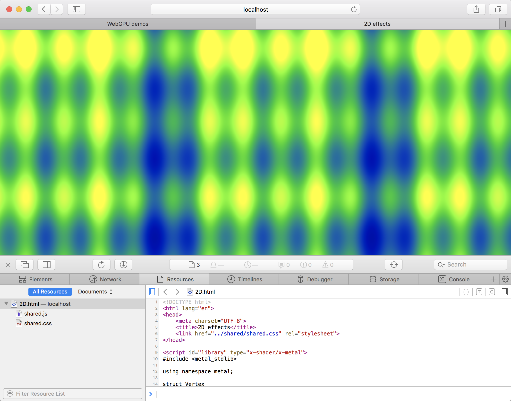
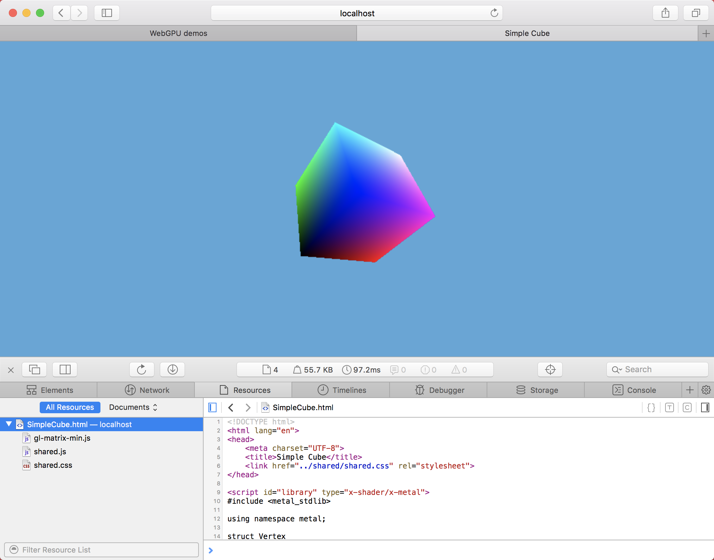
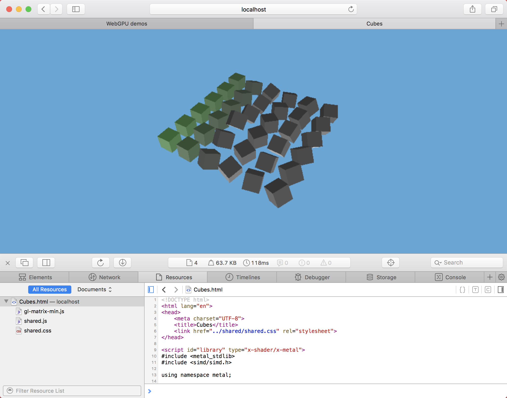
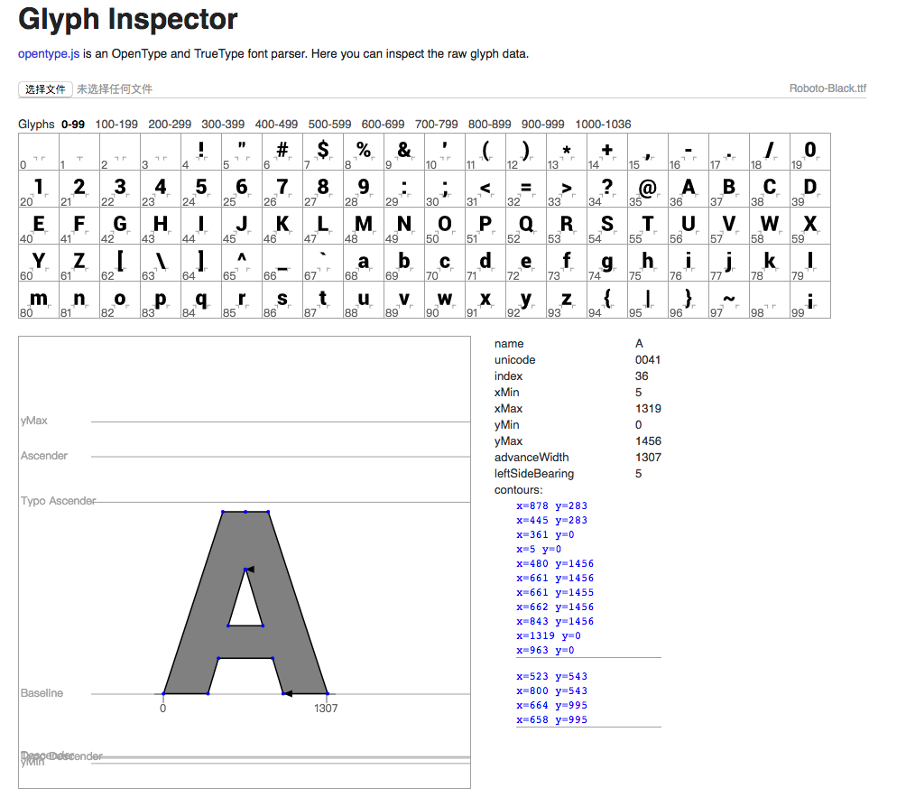

# fuckFrontEnd2017
WTF in 2017

## Web Assembly

```javascript
fetchAndInstantiate('./add.wasm').then(function (instance) {
  console.log(`1 + 2 = ${instance.exports.add(1, 2)}`);
});

// fetchAndInstantiate() found in wasm-utils.js
function fetchAndInstantiate(url, importObject) {
  return fetch(url).then(response =>
    response.arrayBuffer()
  ).then(bytes =>
    WebAssembly.instantiate(bytes, importObject)
  ).then(results =>
    results.instance
  );
}
```

[Wasm demo](http://aicdg.com/fuckFrontEnd2017/wasm/testWasm.html)

[more demos](https://github.com/mdn/webassembly-examples)

## WebGPU(Only works on Safari Technology Preview)

[https://webkit.org/demos/webgpu/](https://webkit.org/demos/webgpu/)



[HelloTriangle](http://aicdg.com/fuckFrontEnd2017/webgpu/HelloTriangle/HelloTriangle.html)



[2D Effects](http://aicdg.com/fuckFrontEnd2017/webgpu/2D/2D.html)



[Simple Cube](http://aicdg.com/fuckFrontEnd2017/webgpu/SimpleCube/SimpleCube.html)



[Cubes](http://aicdg.com/fuckFrontEnd2017/webgpu/Cubes/Cubes.html)

## font rendering(power by opentype.js)



[glyph-inspector](http://aicdg.com/fuckFrontEnd2017/fontRendering/glyph-inspector.html)

## ES6 import in browser(chrome 61+, Firefox 54+, Edge 38+, Safari 10.1+)

```html
<script type="module" src="module.js"></script>
<script type="module">
  // or an inline script
  import {helperMethod} from './providesHelperMethod.js';
  helperMethod();
</script>
```

```javascript
// providesHelperMethod.js
export function helperMethod() {
  console.info(`I'm helping!`);
}
```